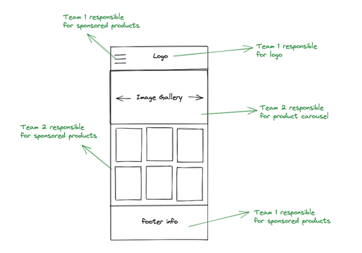

# Build Your Own Micro-Frontend Architecture 

**About Case**

You are working as a Senior Software Developer at an e-commerce company storefront team. There are 10 developers in your team, and the team will grow to be doubled in the next 6 months.  

Storefront team planned to be divided into 2 subteams. 

**Acceptance Criteria**

- Team 1 and Team 2 will run different sprints and have different responsibilities according to domain separation.
- You can use any tech stack which you feel comfortable with.

**Expectations**

The storefront team waits for a POC from you to resolve domain scalability issues by applying micro-frontend architecture.

**Nice to have that could help you to prove your idea**

- An online demo 
- Application Architecture Diagram2
- Proper tech stack
- Simple and non-complex solution

**PS:** Please include **"case is done"** in your last commit.
